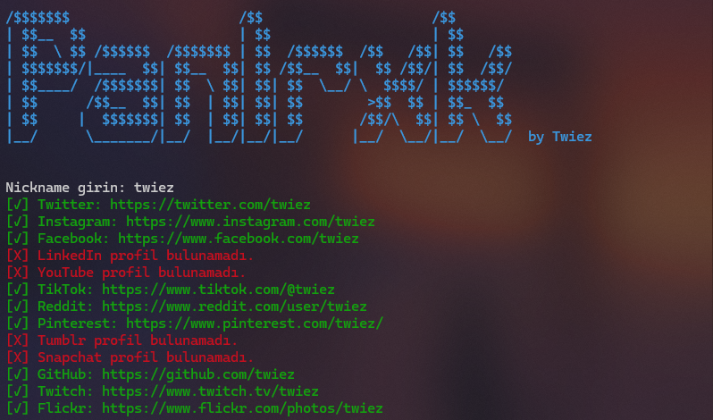

# Panlrxk - Find Social Media Profiles by Username 🔍

---

## Proje Hakkında
Panlrxk, kullanıcı tarafından girilen bir kullanıcı adına göre çeşitli sosyal medya ve forumlarda profilleri arayıp bulan bir Python uygulamasıdır. Proje, birçok popüler platformda tarama yaparak kullanıcı profillerini tespit edebilmekte ve bulunan profilleri anında bağlantı olarak sunmaktadır.



---

## Özellikler
- **Çoklu Platform Desteği**: Twitter, Instagram, GitHub ve daha fazlasında arama yapabilme.
- **Anında Sonuç Görselleştirme**: Bulunan profilleri kolayca görebilir ve erişebilirsiniz.
- **Profesyonel Arayüz**: Proje, bir banner ve renkli geri bildirimlerle kullanıcıya profesyonel bir deneyim sunar.
---

## Kullanılan Teknolojiler
- **Python**: Uygulamanın ana dili.
- **Requests ve BeautifulSoup**: HTTP istekleri ve sayfa içeriği analizleri için.
- **Colorama**: Çıktı metinlerine renkli görseller eklemek için.

---

## Kurulum ve Çalıştırma
1. Projeyi klonlayın:
   
    ```bash
    git clone https://github.com/twiez/Panlrxk.git
    ```
3. Gerekli paketleri yükleyin:
   
    ```bash
    pip install -r requirements.txt
    ```
5. Uygulamayı çalıştırın:
   
    ```bash
    python panlrxk.py
    ```

---

## Desteklenen Platformlar
Projede şu platformlarda arama yapılabilmektedir:
- Twitter
- Instagram
- Facebook
- GitHub
- TikTok
- Reddit
- Ve daha fazlası...

Yeni platformları eklemek için `platforms` sözlüğüne bağlantı formatını ekleyebilirsiniz.

---

## Katkıda Bulunun
Projeye katkıda bulunmak istiyorsanız, GitHub üzerinden bir pull request gönderebilir veya iletişime geçebilirsiniz.

## Destek Olun
Projeyi beğendiyseniz, beni desteklemek için bana bir kahve ısmarlayabilirsiniz:

[Buy Me a Coffee](https://www.buymeacoffee.com/twiez)

